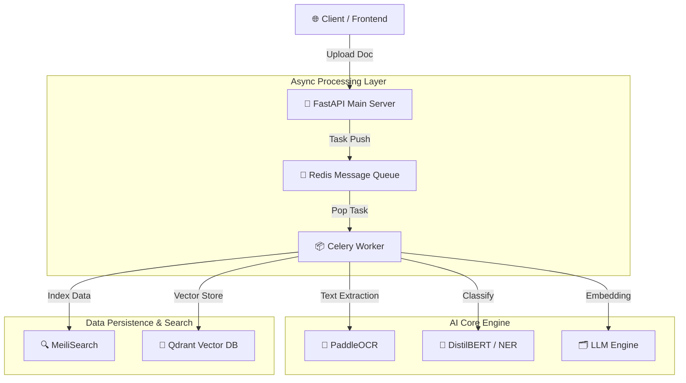

# 🧠 42 Asia Hackathon - 지능형 문서 처리 AI 엔진 (Backend)

<div align="center">


</div>

---

## 🎯 프로젝트 개요

**2025 아시아 해커톤(Asia Hackathon) 출품작**

업로드된 비정형 문서 이미지(PDF/JPG/PNG)를 **OCR(광학 문자 인식), 문서 분류, 정보 추출, 의미 기반 검색**까지 One-Stop으로 처리하는 지능형 AI 백엔드 엔진입니다.

### ✨ 핵심 기능

- **📝 OCR (텍스트 추출)**
  - PaddleOCR을 활용한 고정밀 텍스트 인식
- **📂 문서 분류 (Classification)**
  - DistilBERT 기반 자동 분류 (Invoice, Receipt, Contract 등)
- **🔍 정보 추출 (Extraction)**
  - BERT-NER 기반 핵심 엔티티 구조화 (금액, 날짜, 상호명 등)
- **🤖 의미 기반 검색 (Semantic Search)**
  - LLM(vLLM/Ollama) 활용 벡터 임베딩 및 요약 (Phase 2)
- **💾 하이브리드 검색 저장소**
  - **Keyword Search:** MeiliSearch (빠른 텍스트 검색)
  - **Vector Search:** Qdrant (의미 기반 유사도 검색)

---

## 🏗️ 시스템 아키텍처



---

## ⚙️ 기술 스택 (Tech Stack)

| 구분 | 기술 (Technology) | 설명 |
|:---:|:---:|---|
| **Framework** |  | 고성능 비동기 API 서버 구축 |
| **Async Queue** |  | 대용량 문서 처리 작업을 위한 비동기 큐 |
| **Broker** |  | 메시지 브로커 및 캐싱 |
| **AI Models** | **PaddleOCR, BERT** | 텍스트 인식 및 자연어 처리(NER/Classification) |
| **Search Engine** | **MeiliSearch** | 초고속 전문(Full-text) 검색 엔진 |
| **Vector DB** | **Qdrant** | 고성능 벡터 유사도 검색 엔진 |
| **Infra** |  | Docker Compose 기반 컨테이너 오케스트레이션 |

---

## 🚀 시작 가이드 (Getting Started)

### 1. 환경 변수 설정 (.env)
프로젝트 루트 경로에 `.env` 파일을 생성하고 아래 내용을 입력하세요.

```properties
# Redis Configuration
REDIS_URL=redis://redis:6379/0

# Search Engine Configuration
MEILI_HOST=http://meilisearch:7700
MEILI_MASTER_KEY=your_master_key

# Vector DB Configuration
QDRANT_HOST=http://qdrant:6333
```

### 2. 실행 (Docker Compose)
전체 서비스를 빌드하고 실행합니다.

```bash
docker-compose up --build -d
```

### 3. API 문서 확인
서버가 실행되면 아래 주소에서 Swagger UI를 통해 API를 테스트할 수 있습니다.

- **URL:** [http://localhost:8000/docs](http://localhost:8000/docs)

---

## 📂 디렉토리 구조

```bash
backend/
├── app/
│   ├── main.py              # FastAPI Entrypoint
│   ├── api/                 # API Routers (v1 endpoints)
│   ├── core/                # Config & Security
│   ├── services/            # Business Logic (Service Layer)
│   └── models/              # Pydantic & DB Models
├── worker/
│   ├── celery_app.py        # Celery Configuration
│   └── tasks.py             # Async Tasks (AI inference jobs)
├── docker/                  # Dockerfile & scripts
├── docker-compose.yml       # Container Orchestration
├── requirements.txt         # Python Dependencies
└── README.md                # Project Documentation
```
